# C语言开发环境搭建指南：从零开始配置VS Code

## 📋 前言

学习C语言的第一步就是搭建一个舒适高效的开发环境。经过多方比较，我选择了**Visual Studio Code**（简称VS Code）作为我的主力编辑器。今天就来详细记录我的配置过程，希望对初学者有所帮助。

## 🛠️ 准备工作

### 所需软件清单

1. **Visual Studio Code** - 代码编辑器
2. **MinGW-w64** - C语言编译器（Windows平台）
3. **C/C++扩展** - VS Code的C语言支持

## 📥 安装步骤详解

### 步骤1：安装Visual Studio Code

1. 访问 [VS Code官网](https://code.visualstudio.com/)
2. 下载对应系统的安装包（我使用的是Windows版本）
3. 按照向导完成安装

*提示：安装时建议勾选"添加到PATH"选项，方便在终端直接使用。*

### 步骤2：安装MinGW-w64编译器

#### 对于Windows用户：

```mermaid
graph LR
    A[访问MinGW-w64官网] --> B[下载安装包]
    B --> C[运行安装程序]
    C --> D[选择架构 x86_64]
    D --> E[选择线程模型 posix]
    E --> F[选择异常处理 seh]
    F --> G[设置安装路径]
    G --> H[添加到系统PATH]
    H --> I[验证安装]
```



1. **下载地址**：[MinGW-w64官网](https://www.mingw-w64.org/)
2. **MSYS2**(全面) 或者 **w64devkit**(轻量)
3. **版本选择**：
    - Architecture: `x86_64`
    - Threads: `posix`
    - Exception: `seh`
4. **安装路径**：建议使用无空格路径，如 `C:\mingw64`

#### 验证安装是否成功：

```bash
打开命令提示符，输入：
gcc --version
```

### 步骤3：配置VS Code

#### 安装必要扩展

在VS Code扩展商店中搜索并安装：

1. **C/C++** (Microsoft官方扩展)
2. **Code Runner** (快速运行代码)
3. **Chinese Language Pack** (中文语言包，可选)

#### 创建第一个C语言项目

```bash
# 1. 创建项目文件夹
mkdir my_c_project
cd my_c_project

# 2. 创建第一个C文件
touch hello.c
```

#### 配置tasks.json（编译任务）

按 `Ctrl+Shift+P` 打开命令面板，输入 `tasks: Configure Task`，选择 `C/C++: gcc.exe build active file`

生成的 `tasks.json` 示例：

```json
{
    "version": "2.0.0",
    "tasks": [
        {
            "type": "shell",
            "label": "C/C++: gcc.exe 生成活动文件",
            "command": "C:\\mingw64\\bin\\gcc.exe",
            "args": [
                "-fdiagnostics-color=always",
                "-g",
                "${file}",
                "-o",
                "${fileDirname}\\${fileBasenameNoExtension}.exe"
            ],
            "options": {
                "cwd": "${fileDirname}"
            },
            "problemMatcher": [
                "$gcc"
            ],
            "group": {
                "kind": "build",
                "isDefault": true
            }
        }
    ]
}
```

#### 配置launch.json（调试配置）

1. 切换到调试视图（左侧活动栏的虫形图标）
2. 点击"创建launch.json文件"
3. 选择"C++ (GDB/LLDB)"

`launch.json` 示例：

```json
{
    "version": "0.2.0",
    "configurations": [
        {
            "name": "gcc.exe - 生成和调试活动文件",
            "type": "cppdbg",
            "request": "launch",
            "program": "${fileDirname}\\${fileBasenameNoExtension}.exe",
            "args": [],
            "stopAtEntry": false,
            "cwd": "${fileDirname}",
            "environment": [],
            "externalConsole": true,
            "MIMode": "gdb",
            "miDebuggerPath": "C:\\mingw64\\bin\\gdb.exe",
            "setupCommands": [
                {
                    "description": "为 gdb 启用整齐打印",
                    "text": "-enable-pretty-printing",
                    "ignoreFailures": true
                }
            ],
            "preLaunchTask": "C/C++: gcc.exe 生成活动文件"
        }
    ]
}
```

## 🚀 创建并运行第一个程序

### hello.c

```c
#include <stdio.h>

int main() {
    printf("Hello, C World! 🎉\n");
    printf("这是我的第一个C程序！\n");
    printf("VS Code环境配置成功！\n");

    // 计算并显示一些基本信息
    int a = 10;
    int b = 20;
    printf("\n%d + %d = %d\n", a, b, a + b);

    return 0;
}
```

### 运行方法

1. **使用Code Runner**：按 `Ctrl+Alt+N`

2. **使用终端编译运行**：
   
   ```bash
   gcc hello.c -o hello
   ./hello
   ```

3. **使用调试功能**：按 `F5` 开始调试

## 🔧 常用配置优化

### settings.json 推荐配置

```json
{
    "files.associations": {
        "*.c": "c"
    },
    "C_Cpp.default.intelliSenseMode": "windows-gcc-x64",
    "editor.formatOnSave": true,
    "code-runner.runInTerminal": true,
    "code-runner.saveFileBeforeRun": true,
    "code-runner.executorMap": {
        "c": "cd $dir && gcc $fileName -o $fileNameWithoutExt && $dir$fileNameWithoutExt"
    }
}
```

### 推荐安装的辅助扩展

- **Better Comments** - 彩色注释
- **Bracket Pair Colorizer** - 括号配对颜色
- **indent-rainbow** - 缩进彩虹色
- **C/C++ Themes** - 代码主题

## 🐛 常见问题解决

### Q1: "gcc不是内部或外部命令"

**解决方法**：

1. 检查MinGW是否安装正确
2. 确认系统PATH环境变量包含MinGW的bin目录
3. 重启VS Code或电脑

### Q2: 中文显示乱码

**解决方法**：

```c
// 在代码开头添加
#include <locale.h>
int main() {
    setlocale(LC_ALL, "zh_CN.UTF-8");
    // ... 其他代码
}
```

### Q3: 调试时无法命中断点

**解决方法**：

1. 确保编译时加了 `-g` 参数
2. 检查launch.json配置是否正确
3. 重新生成调试配置

## 📈 环境验证清单

- [x] VS Code成功安装
- [x] MinGW-w64正确安装
- [x] gcc命令可用
- [x] C/C++扩展安装
- [x] 能成功编译hello.c
- [x] 能正常调试程序

## 🎯 下一步计划

现在开发环境已经搭建完成，接下来我将：

1. 系统学习C语言基础语法
2. 练习常用数据结构和算法
3. 尝试编写一些小项目
4. 学习使用Git进行版本控制

## 💭 心得体会

搭建环境的过程虽然有些繁琐，但这是一个很好的学习机会。通过解决安装和配置中遇到的问题，我对开发环境有了更深入的理解。**一个好的开始是成功的一半**，现在我已经准备好开始正式的C语言学习了！

---

**配置时间**：2026年1月4日  
**系统环境**：Windows 10 + VS Code 2.0
